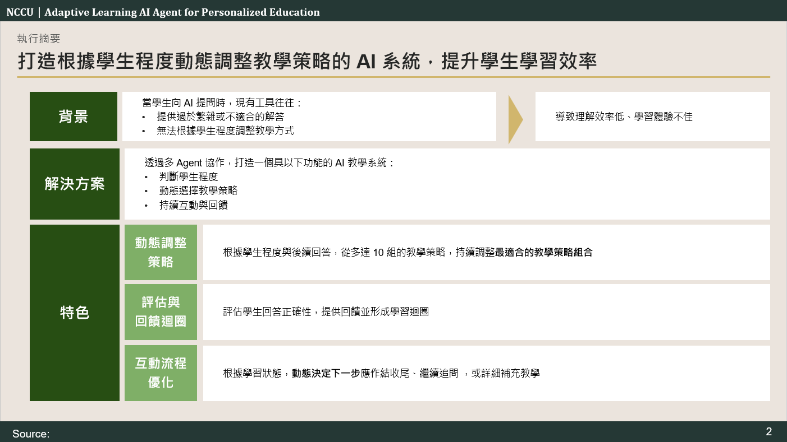
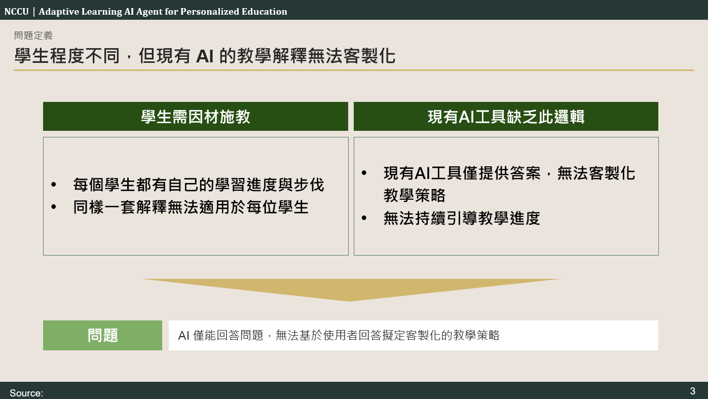
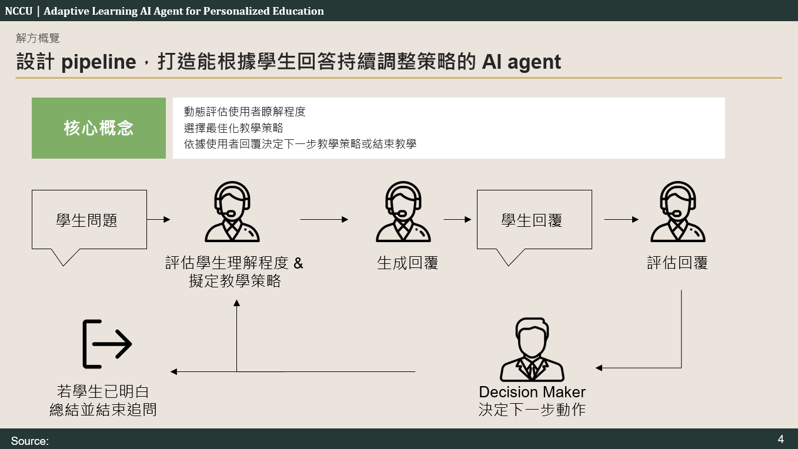
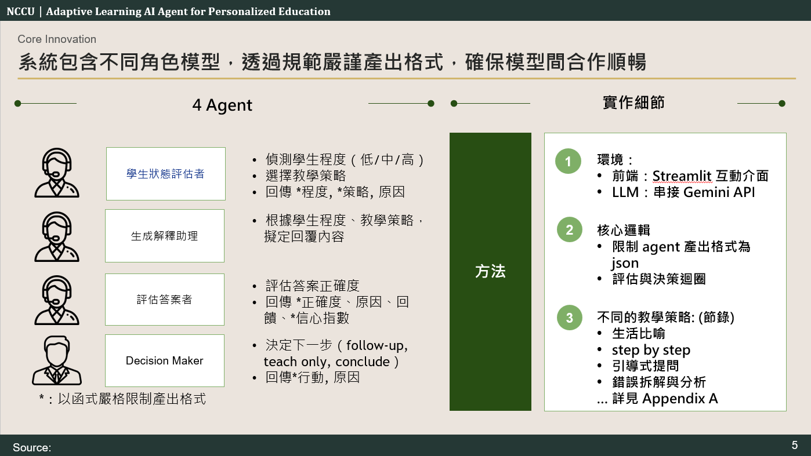
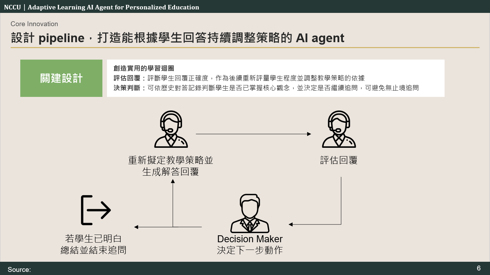
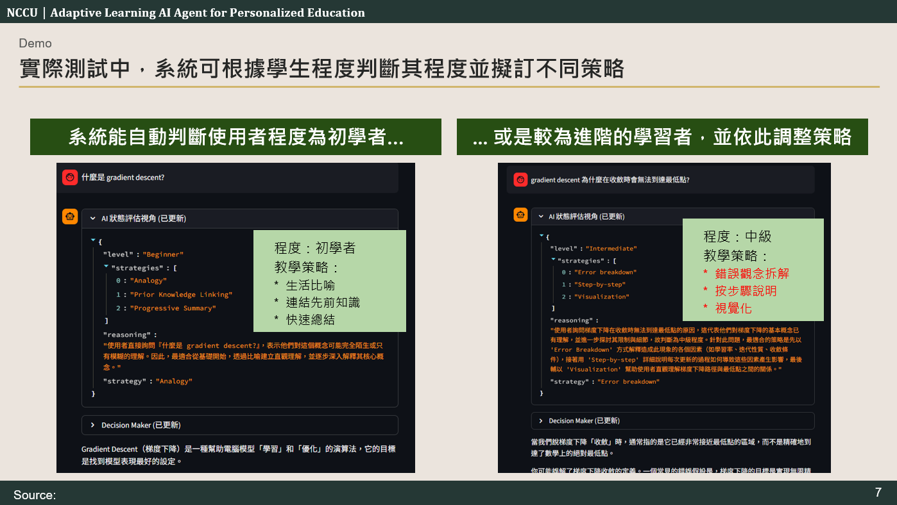
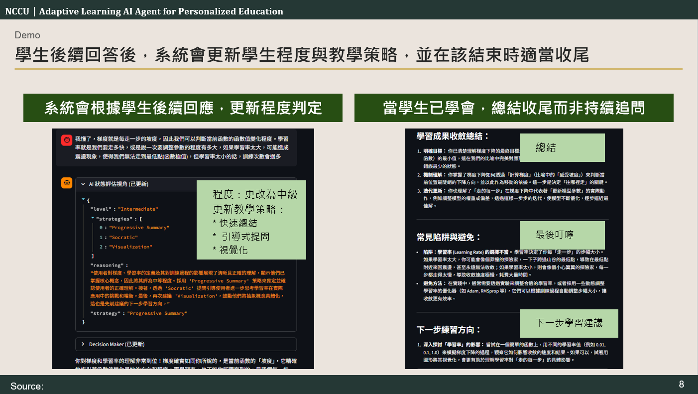
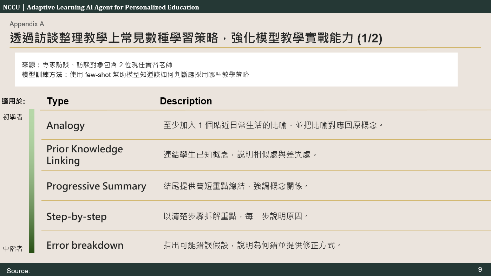
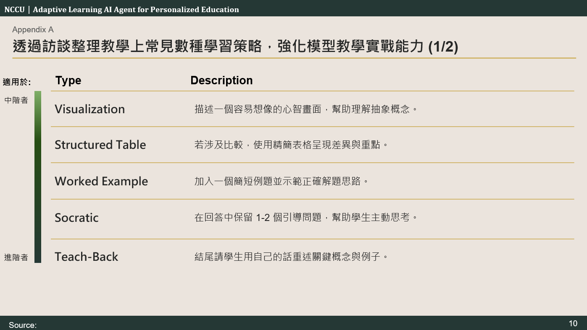

## Environment Variables

Create a `.env` file and add:
GOOGLE_API_KEY=your_api_key_here

## Introduction

[View Slides](https://1drv.ms/p/c/37b79e2d0603e520/IQBzFsomix1dRId1b_cyI5z4Abg-e8P2mThDeKb_spcsVOs) or see the following slides

### Problem

### Solution

### Appendix

